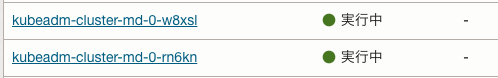

# Oracle Cloud Hangout Cafe Season7 #5 Cluster API

## Directory Configuration

```sh
.
├── README.md
├── autoscaler
│   ├── scale.yaml
│   └── workload
│       └── nginx.yaml
└── clusterapi
    ├── kubeadm.yaml
    ├── ocne.yaml
    └── oke.yaml
```

## Management Clusterの構築

### OKEのプロビジョニング

OKEのプロビジョニングについては、[こちら](https://oracle-japan.github.io/ocitutorials/cloud-native/oke-for-commons/)の手順をベースに実施してください。
ただし、Worker Nodeのスペックを以下に設定してください。

- Node数: 3
- OCPU: 2
- Memory: 8

### clusterctlのインストール

ここではv1.5.2をインストールします。

```sh
curl -L https://github.com/kubernetes-sigs/cluster-api/releases/download/v1.5.2/clusterctl-linux-amd64 -o clusterctl
```

実行権限とパスを変更します。

```sh
sudo install -o root -g root -m 0755 clusterctl /usr/local/bin/clusterctl
```

これでインストールは完了です。

以下のコマンドが実行できればOKです。

```sh
$ clusterctl version
clusterctl version: &version.Info{Major:"1", Minor:"5", GitVersion:"v1.5.2", GitCommit:"3290c5a28ed28c1909713e59e5d481a3e8f68a90", GitTreeState:"clean", BuildDate:"2023-09-26T15:50:41Z", GoVersion:"go1.20.8", Compiler:"gc", Platform:"linux/amd64"}
```

### Cluster APIのインストール

Cluster APIをインストールします。

今回は、OCI上でのKubeadmを利用したクラスタ、OKEクラスタ、Oracle Cloud Native Environmentクラスタを構築するため、KubeadmのControl Plane APIおよびBootstrap API、Cluster API for OCI、Cluster API for OCNEをインストールします。

```sh
clusterctl init --infrastructure oci --bootstrap ocne --control-plane ocne --bootstrap kubeadm  --control-plane kubeadm
```

これでManagement Clusterの構築は完了です。

## Workload Clusterの構築


### ポリシーの設定

Management ClusterであるOKEから各種クラスタをプロビジョニングできるようにポリシーを設定します。  

#### 動的グループの作成

[こちら](https://docs.oracle.com/ja-jp/iaas/Content/Identity/Tasks/managingdynamicgroups.htm)を参考に以下の動的グループを作成してください。  '
動的グループ名は`clusteraapi-dyn-group`とします。  

```sh
instance.compartment.id = '<コンパートメントOCID>'
```

#### ポリシーの作成

[こちら](hhttps://docs.oracle.com/ja-jp/iaas/Content/Identity/Tasks/managingpolicies.htm)を参考に以下のポリシーを作成してください。 
ポリシーは`clusterapi_policy`とします。  

```sh
Allow dynamic-group clusteraapi-dyn-group to manage instance-family in compartment tmm-evaluation	
Allow dynamic-group clusteraapi-dyn-group to manage virtual-network-family in compartment tmm-evaluation	
Allow dynamic-group clusteraapi-dyn-group to manage load-balancers in compartment tmm-evaluation	
Allow dynamic-group clusteraapi-dyn-group to use subnets in compartment tmm-evaluation	
Allow dynamic-group clusteraapi-dyn-group to inspect compartments in compartment tmm-evaluation	
Allow dynamic-group clusteraapi-dyn-group to use vnics in compartment tmm-evaluation	
Allow dynamic-group clusteraapi-dyn-group to use network-security-groups in compartment tmm-evaluation	
Allow dynamic-group clusteraapi-dyn-group to use private-ips in compartment tmm-evaluation	
Allow dynamic-group clusteraapi-dyn-group to manage public-ips in compartment tmm-evaluation	
Allow dynamic-group clusteraapi-dyn-group to use private-ips in compartment tmm-evaluation	 
Allow dynamic-group clusteraapi-dyn-group to manage cluster-family in compartment tmm-evaluation
```

### Kubeadmクラスタ用のカスタムイメージの作成

ここでは、この後作成するKubeadmクラスタで利用するWorker Nodeのカスタムイメージを作成します。

カスタムイメージはPackerというツールを利用して実施します。  
手順は[こちら](https://github.com/kubernetes-sigs/image-builder)を参考に実施してください。  
とりあえず試したい方は、[こちらでカスタムイメージを公開](https://objectstorage.us-ashburn-1.oraclecloud.com/p/8u0KE_tZsfnxAkDbQOUKuKTUv4Ifch1OvSWSA3bKw_6h6woBdyp6QSwauuHlYSMD/n/orasejapan/b/TestData/o/exported-image-20230829-1556)しているので、ご自身の環境にインポートしてください。  
インポートの方法は[こちら](https://docs.oracle.com/ja-jp/iaas/Content/Compute/Tasks/imageimportexport.htm#Importing)を参考に実施してください。  

### Cluster APIで利用する環境変数の設定

ここでは、この後で利用する環境変数を設定していきます。

[こちら](https://docs.oracle.com/ja-jp/iaas/Content/Identity/Tasks/managingdynamicgroups.htm)を参考に動的グループを作成します。
 

env/envファイルの`CHANGE ME!!`項目を埋めます。

```sh
export OCI_TENANCY_ID="CHANGE ME!!"!!
export OCI_REGION="CHANGE ME!!"
export OCI_COMPARTMENT_ID="CHANGE ME!!"
export OCI_MANAGED_NODE_IMAGE_ID="CHANGE ME!!"
export OCI_OCNE_IMAGE="CHANGE ME!!"
export OCI_SSH_KEY="CHANGE ME!!"
```

#### OCI_TENANCY_ID/OCI_COMPARTMENT_ID

OCI_TENANCY_IDは[こちら](https://docs.oracle.com/ja-jp/iaas/Content/General/Concepts/identifiers.htm#:~:text=%E3%83%86%E3%83%8A%E3%83%B3%E3%82%B7OCID%E3%81%AF%E3%80%81Oracle%20Cloud%20Infrastructure%20Console%E3%81%AE%E3%80%8C%E3%83%86%E3%83%8A%E3%83%B3%E3%82%B7%E8%A9%B3%E7%B4%B0%E3%80%8D%E3%83%9A%E3%83%BC%E3%82%B8%E3%81%A7%E7%A2%BA%E8%AA%8D%E3%81%A7%E3%81%8D%E3%81%BE%E3%81%99:%20*%20%E3%80%8C%E3%83%97%E3%83%AD%E3%83%95%E3%82%A1%E3%82%A4%E3%83%AB%E3%80%8D%E3%83%A1%E3%83%8B%E3%83%A5%E3%83%BC%E3%82%92%E9%96%8B%E3%81%8D%E3%80%81%E3%80%8C%E3%83%86%E3%83%8A%E3%83%B3%E3%82%B7:%20%E3%80%8D%20%E3%82%92%E3%82%AF%E3%83%AA%E3%83%83%E3%82%AF%E3%81%97%E3%81%BE%E3%81%99%20*%20%E3%83%86%E3%83%8A%E3%83%B3%E3%82%B7OCID%E3%81%8C%E3%80%8C%E3%83%86%E3%83%8A%E3%83%B3%E3%82%B7%E6%83%85%E5%A0%B1%E3%80%8D%E3%81%AE%E4%B8%8B%E3%81%AB%E8%A1%A8%E7%A4%BA%E3%81%95%E3%82%8C%E3%81%BE%E3%81%99%E3%80%82)、OCI_COMPARTMENT_IDは[こちら](https://docs.oracle.com/ja-jp/iaas/Content/GSG/Tasks/contactingsupport_topic-Finding_the_OCID_of_a_Compartment.htm#:~:text=%E3%82%B3%E3%83%B3%E3%83%91%E3%83%BC%E3%83%88%E3%83%A1%E3%83%B3%E3%83%88%E3%81%AEOCID%E3%81%AE%E6%A4%9C%E7%B4%A2%20*%20%E3%83%8A%E3%83%93%E3%82%B2%E3%83%BC%E3%82%B7%E3%83%A7%E3%83%B3%E3%83%BB%E3%83%A1%E3%83%8B%E3%83%A5%E3%83%BC%E3%82%92%E9%96%8B%E3%81%8D%E3%80%81%E3%80%8C%E3%82%A2%E3%82%A4%E3%83%87%E3%83%B3%E3%83%86%E3%82%A3%E3%83%86%E3%82%A3%E3%81%A8%E3%82%BB%E3%82%AD%E3%83%A5%E3%83%AA%E3%83%86%E3%82%A3%E3%80%8D%E3%82%92%E3%82%AF%E3%83%AA%E3%83%83%E3%82%AF%E3%81%97%E3%81%BE%E3%81%99%E3%80%82%20%E3%80%8C%E3%82%A2%E3%82%A4%E3%83%87%E3%83%B3%E3%83%86%E3%82%A3%E3%83%86%E3%82%A3%E3%80%8D%E3%81%A7%E3%80%81%E3%80%8C%E3%82%B3%E3%83%B3%E3%83%91%E3%83%BC%E3%83%88%E3%83%A1%E3%83%B3%E3%83%88%E3%80%8D%E3%82%92%E3%82%AF%E3%83%AA%E3%83%83%E3%82%AF%E3%81%97%E3%81%BE%E3%81%99%E3%80%82)を参考に取得してください。

#### OCI_REGION

[こちら](https://docs.oracle.com/ja-jp/iaas/Content/General/Concepts/regions.htm)のページでご自身が利用されるリージョン識別子を取得してください。

#### OCI_MANAGED_NODE_IMAGE_ID

[Kubeadmクラスタ用のカスタムイメージの作成](#kubeadmクラスタ用のカスタムイメージの作成)でインポートしたカスタムイメージのOCIDをコンソールから取得してください。

#### OCI_OCNE_IMAGE

[こちら](https://docs.oracle.com/en-us/iaas/images/oracle-linux-8x/)からご自身が利用されるリージョンに紐づくイメージOCIDを取得してください。

#### OCI_SSH_KEY

Worker NodeにSSHログインするためのSSHキーを設定してください。  
こちらは必須です。

例
```sh
OCI_SSH_KEY=ssh-rsa AAAAB3NzaC1ycxxxxxxxxxxxxmeGV4+L6j8bB
```

最後に環境変数をエクスポートします。  

```sh
source env/env.sh
```

### k8s with Kubeadm on OCI Compute環境の構築

まずは、OCI Compute上にKubeadmを利用したクラスタを構築します。  

以下のコマンドを実行だけで構築できます。

```sh
clusterctl generate cluster oke-cluster --from ochacafe-cluster-api/clusterapi/oke.yaml |kubectl apply -f - --server-side
```

以下のコマンドで状況を確認できます。

```sh
clusterctl describe cluster oke-cluster
```

プロビジョニング完了までには10分ほどかかります。  

プロビジョニングしたクラスタのKubeconfigを取得する場合は以下のコマンドを実行します。  
今回のManifestでは、ClusterResourceSetを利用してContainer Network InteerfaceとしてCalico、OCIのCloud Controller Managerも一緒にデプロイしています。  

```sh
clusterctl get kuebconfig kubeadm-cluster > kubeadm.config
```

```sh
kubectl get node --kubeconfig kubeadm-cluster
```

### OCNE on OCI Compute環境の構築

次に、OCI Compute上にOCNEを利用したクラスタを構築します。  

以下のコマンドを実行だけで構築できます。

```sh
clusterctl generate cluster ocne-cluster --from ochacafe-cluster-api/clusterapi/ocne.yaml |kubectl apply -f - --server-side
```

以下のコマンドで状況を確認できます。

```sh
clusterctl describe cluster ocne-cluster
```

プロビジョニングしたクラスタのKubeconfigを取得する場合は以下のコマンドを実行します。  
今回のManifestでは、ClusterResourceSetを利用してContainer Network InteerfaceとしてCalico、OCIのCloud Controller Managerも一緒にデプロイしています。  

```sh
clusterctl get kuebconfig ocne-cluster > ocne.config
```

```sh
kubectl get node --kubeconfig ocne-cluster
```

### OKE環境の構築

次に、OKEクラスタを構築します。  

以下のコマンドを実行だけで構築できます。

```sh
clusterctl generate cluster oke-cluster --from ochacafe-cluster-api/clusterapi/oke.yaml |kubectl apply -f -
```

以下のコマンドで状況を確認できます。

```sh
clusterctl describe cluster oke-cluster
```

プロビジョニング完了までには10分ほどかかります。
プロビジョニングしたクラスタのKubeconfigを取得する場合は以下のコマンドを実行します。    

```sh
clusterctl get kuebconfig ocne-cluster > oke.config
```

```sh
kubectl get node --kubeconfig oke-cluster
```

### ヘルスチェック機能の動作確認

ここでは、Cluster APIのヘルスチェックの動作確認をします。    
今回はKubeadmクラスタのWorker Nodeに対してヘルスチェックの設定をしています。(もちろんControl Planeに対して設定することも可能です)  

OCIコンソール画面でCompute一覧を開きます。  

先ほど作成したKubeadmクラスタのWorker Nodeインスタンス(`kubeadm-cluster-md-0-xxxx`)を停止させます。  

 

`ただちに電源を切断することで、インスタンスを強制停止します。`にチェックを入れて、`インスタンスを強制停止`をクリックします。  

 

インスタンスが停止されます。  

 

今回はWorker NodeのステータスがReadyでない状態が1分以上継続するとタイムアウトする設定をしているので、1分ほど経過するとインスタンスが自動的に終了します。  

 

インスタンスが終了後に新たにWorker Nodeインスタンスがプロビジョニングされます。  
これにより、自動的にクラスタが復旧します。  

 

### オートスケール

ここでは、Cluster APIを利用したオートスケールを確認します。  

まずは、Management ClusterがWorkload Clusterの状態を確認できるようにKubeconfigをSecretとして登録します。  
今回は、Kubeadmクラスタを利用します。  
登録するKubeconfigはKubeadmクラスタ作成時に取得したものです。 
後ほどCluster Autoscaler用のDeploymentをkube-systemネームスペースにデプロイするため、kube-systemに対して登録します。  

```sh
kubectl create secret generic kubeconfig --from-file=kubeconfig=kubeadm.config -n kube-system
```

Cluster Autoscaler用のDeploymentをデプロイします。  

```sh
kubectl apply -f autoscaler/scale.yaml
```

Cluster Autoscalerを行うためにNGINXのPodをKubeadmクラスタにデプロイします。　　

```sh
kubectl apply -f autoscaler/workload/nginx.yaml --kubeconfig=kubeadm.config
```

デプロイするとリソース不足により、PendingのPodが発生します。  

```sh
$ kubectl get pods --kubeconfig=kubeadm.config
NAME                     READY   STATUS    RESTARTS   AGE
nginx-7bc465bf6f-6v2xz   0/1     Pending   0          25s
nginx-7bc465bf6f-bpk6z   1/1     Running   0          25s
nginx-7bc465bf6f-rbj6t   1/1     Running   0          25s
nginx-7bc465bf6f-t28sl   0/1     Pending   0          25s
nginx-7bc465bf6f-vjd66   1/1     Running   0          25s
```

しばらくすると新たにWorker Nodeが起動してくるのが確認できます。  

 


